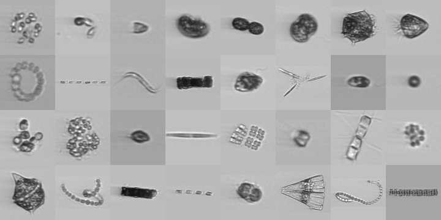

# Plankton Image Classification (SYKE)



## Contents
- [Introduction](#introduction)
- [Setup](#setup)
  - [Requirements](#requirements)
  - [Installation](#installation)
- [Usage](#usage)
  - [Training a classifier](#training-a-classifier)
  - [Using a classifier for inference](#classifier-inference)
    <!-- - Interacting with Allas -->
  - [Analysing results](#Analysing-results)
    - [Inspecting prediction results](#inspect-predictions)
    - [Manual labeling](#label-new-images)
    - [Creating plots from prediction results](#plotting-results)

## Introduction

> Finnish Environment Institute (abbr. SYKE in Finnish)

> Marine Research Centre (abbr. MRC, sub-organisation of SYKE)

This repository contains code for training and using convolutional neural networks in the automatic classification of plankton images. It is a part of MRC's goal to introduce new automatic monitoring and research methods for the Baltic Sea.

`syke-pic` is tailor-made for MRC's needs. It currently only supports plankton images collected from the Imaging FlowCytobot (IFCB). This means it is not really meant for outside use, although there are no restrictions on the code reuse (see LICENCE).

**Warning**! This project is still a work in progress. For example, the code lacks all unit testing and has been built and used solely on a Linux machine. Windows compatibility is not guaranteed for everything.

## Setup

First step is to download the code to your machine:
```bash
# Download into the current working directory
git clone https://github.com/veot/syke-pic.git

# Make sure to change to project root directory
cd syke-pic
```

### Requirements

The Conda package and environment management system is recommended. See https://docs.conda.io/en/latest/ for instructions.

`envs/` contains three `yaml`-files that can be used to configure Conda environments with varying dependencies:
- `envs/no_pytorch.yaml` does not install PyTorch, which means that `sykepic` can only be used for analysis purposes.
- `envs/cpu.yaml` and `envs/gpu.yaml` will install PyTorch for CPU or GPU systems respectively. When installing for GPU support, first check that the version of `cudatoolkit` inside `envs/gpu.yaml` matches your system.

Install and configure the environment with:
  ```bash
  conda env create -f envs/<yaml>
  ```
Where `<yaml>` is any of the above mentioned files. All of them will create a new conda environment called `sykepic` (name can be changed inside the `yaml`-file).


### Installation

Make sure the right Python environment is activated. If you configured Conda from the above instructions, this command looks like:
```bash
conda activate sykepic
```

Then `syke-pic` can be installed with:

```bash
python setup.py install
```

This command installs a Python package and an executable program, both named `sykepic`.

## Usage

### Training a classifier

Model training should really only be done with a configured, CUDA capable GPU. This guide will not go into how this can be achieved.

Training is done from the command line with the executable program `sykepic`. An example of this looks like:

```bash
sykepic train examples/train.ini
```

It uses the sub-command `train` and has one required argument, a configuration file. An example config file, with good default settings is found in `examples/train.ini`. However, some settings need to be changed to match your system. Check at least these settings:

- `[dataset] path`
- `[model] path`
- `[image] batch_size, num_workers`

More instructions for specific options are found in the comments of the config file.

### Other training options

#### Save a collage of training images

Useful for inspecting the effects of image augmentations. 
The following example saves a 7x14 collage of images to `train_collage_7x14.png` in the current working directory:
```bash
sykepic train examples/train.ini --collage 7 14 train_collage_7x14.png 
```
Note the order of arguments: `--collage <height> <width> <file>`

#### Save a class distribution plot 
This plot is created for the training dataset specified in the config file. The following example saves the plot into a file called `class_distribution.png` in the current working directory:
```bash
sykepic train examples/train.ini --dist class_distribution.png
```

### Note
You can see equivalent usage information from the command line with:
```bash
sykepic train -h
```

## Classifier inference

Model inference is done with the command `sykepic predict`:
```bash
sykepic predict <model directory> <raw directory> <output directory>
```
- `<model directory>` is a path to a directory of a trained classifier.
- `<raw directory>` is a path to the root directory with the raw IFCB data you want predictions for.
- `<output directory>` is a path to the directory where prediction results will be saved.

An example of this might look like:
```bash
sykepic predict examples/models/resnet18 examples/raw examples/new_predictions
```

The classification results are stored in sample specific CSV-files in `<output directory>`. Each CSV-file has rows for all non-empty ROI in the sample, along with probabilities for each class.

The folder structure of `<output directory>` follows a predefined pattern with three sub-directories: `year/month/day`. These dates are inferred from the timestamp of the IFCB sample, e.g. the prediction results for a sample named `D20180703T093453_IFCB114` would be saved to:  
`<output directory>/2018/07/03/D20180703T093453_IFCB114.csv`

There are also optional arguments for `sykepic predict`, such as:
- `-b, --batch_size`
- `-w, --num_workers`

To list all of the arguments and show more information, use the help menu:
```bash
sykepic predict -h
```

### Interaction with Allas
No documentation available.
#### Realtime inference
#### Synchronising files

## Analysing results

### Inspect predictions
It is a good idea to manually inspect classification results. Luckily `syke-pic` contains a graphical tool for Jupyter Notebook that does exactly this. It's aptly named the `PredictionViewer`.

There is a Jupyter notebook with a usage example in:  
`examples/inspecting_predictions.ipynb`

### Label new images
Manual labeling is best done with the help of the classification results (i.e. active learning). To enable this, `syke-pic` uses the same graphical tool that is  used for inspecting the results, `PredictionViewer`

See this Jupyter notebook for an example:  
`examples/manual_labeling.ipynb`.

### Plotting results
`syke-pic` also has some code to create simple frequency plots from the classification results.

See this Jupyter notebook for an example:  
`examples/frequency_plotting.ipynb`
